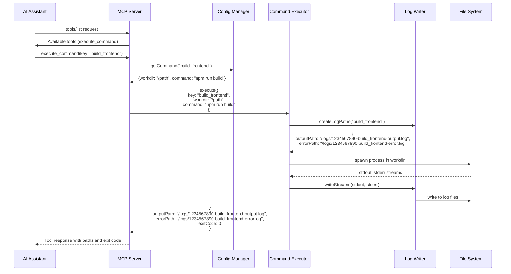

# MCPコマンド実行サーバー 基本設計書

## 概要

本設計書は、MCPプロトコルに準拠したコマンド実行サーバーの基本設計を定義します。このサーバーは、事前定義されたコマンドをキー指定で実行し、実行結果をログファイルとして保存する機能を提供します。

## アーキテクチャ

### システム構成

```
┌─────────────────┐
│  AI Assistant   │
│   (MCP Client)  │
└────────┬────────┘
         │ MCP Protocol
         │
┌────────▼────────┐
│   MCP Server    │
│ ┌─────────────┐ │
│ │   Config    │ │ ← config.json
│ │   Loader    │ │
│ └─────────────┘ │
│ ┌─────────────┐ │
│ │  Command    │ │
│ │  Executor   │ │
│ └─────────────┘ │
│ ┌─────────────┐ │
│ │    Log      │ │ → output/error logs
│ │   Writer    │ │
│ └─────────────┘ │
└─────────────────┘
```

### レイヤー構成

1. **プレゼンテーション層（MCP Interface）**
   - MCPプロトコルの実装
   - ツール定義とリクエスト/レスポンス処理

2. **ビジネスロジック層（Command Management）**
   - コマンド実行管理
   - 設定ファイル管理
   - バリデーション

3. **インフラストラクチャ層（System Interface）**
   - プロセス実行
   - ファイルシステム操作（ログ書き込み）

## データフロー



## 主要コンポーネント設計

### 1. MCP Server (src/long-run-command-mcp.ts)
- **責務**: MCPプロトコルの実装とリクエストハンドリング
- **主要インターフェース**:
  ```typescript
  interface MCPServer {
    start(): Promise<void>
    registerTool(tool: Tool): void
  }
  ```

### 2. Config Manager (src/config/ConfigManager.ts)
- **責務**: 設定ファイルの読み込みと管理
- **主要インターフェース**:
  ```typescript
  interface Config {
    outputdir: string
    commands: Record<string, CommandConfig>
  }
  
  interface CommandConfig {
    workdir: string
    command: string
  }
  
  interface ConfigManager {
    loadConfig(path: string): Promise<Config>
    getCommand(key: string): CommandConfig | undefined
    getOutputDir(): string
  }
  ```

### 3. Command Executor (src/executor/CommandExecutor.ts)
- **責務**: コマンドの実行とプロセス管理
- **主要インターフェース**:
  ```typescript
  interface ExecutionRequest {
    key: string
    workdir: string
    command: string
  }
  
  interface ExecutionResult {
    outputPath: string
    errorPath: string
    exitCode: number
  }
  
  interface CommandExecutor {
    execute(request: ExecutionRequest): Promise<ExecutionResult>
  }
  ```

### 4. Log Writer (src/logger/LogWriter.ts)
- **責務**: ログファイルの作成と管理
- **主要インターフェース**:
  ```typescript
  interface LogPaths {
    outputPath: string
    errorPath: string
  }
  
  interface LogWriter {
    createLogPaths(key: string): LogPaths
    writeStreams(
      stdout: ReadableStream,
      stderr: ReadableStream,
      paths: LogPaths
    ): Promise<void>
  }
  ```

## エラーハンドリング

1. **設定ファイルエラー**
   - ファイルが存在しない
   - JSONパースエラー
   - 必須フィールドの欠落

2. **コマンド実行エラー**
   - 存在しないキーの指定
   - 作業ディレクトリが存在しない
   - コマンド実行権限がない

3. **ログ書き込みエラー**
   - 出力ディレクトリへの書き込み権限がない
   - ディスク容量不足

## テスト戦略

### 1. Unit Tests
- **ConfigManager**: 設定ファイルの読み込みとバリデーション
- **CommandExecutor**: コマンド実行ロジック（モック使用）
- **LogWriter**: ログファイルパス生成とストリーム処理

### 2. Integration Tests
- **MCP Server**: MCPプロトコルのリクエスト/レスポンス
- **End-to-End Flow**: 実際のコマンド実行とログ出力

### 3. E2E Tests
- **実環境テスト**: 実際のMCPクライアントからの接続とコマンド実行

## セキュリティ考慮事項

1. **コマンドインジェクション対策**
   - 事前定義されたコマンドのみ実行
   - 動的なコマンド生成の禁止

2. **ディレクトリトラバーサル対策**
   - 作業ディレクトリの検証
   - 相対パスの解決と検証

3. **権限管理**
   - 実行ユーザーの権限で動作
   - ログディレクトリへの適切な権限設定

---

この基本設計ファイルに問題がないか確認してください。修正が必要な点があればお知らせください。
